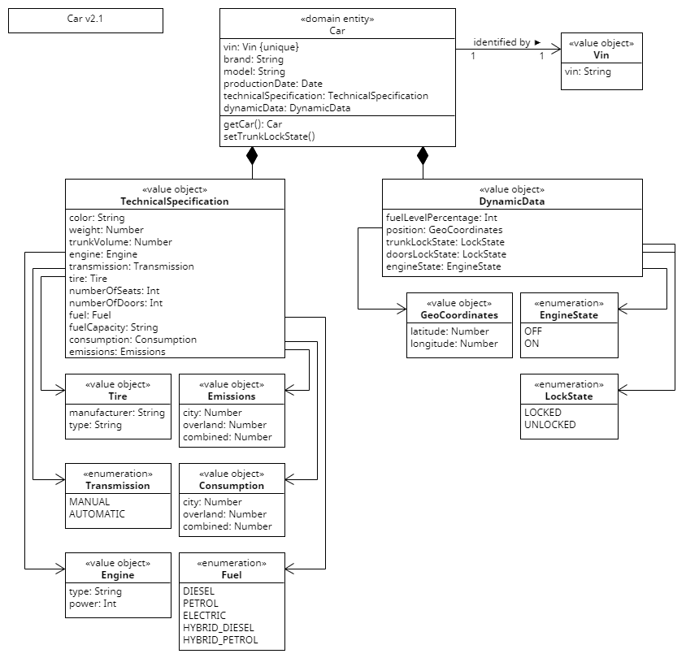

# Domain API Diagram Car

**Figure: Domain API Diagram of Car**

(Car) The entity is identified by its VIN. Besides general information on the car, like brand, model, and productionDate, the entity contains further static and dynamic data. The value object TechnicalSpecification specifies the static data. The value object DynamicData holds the car's dynamic data.

(TechnicalSpecification) Encapsulates the core physical makeup of the car (like color and trunkVolume) and a car's performance (like consumption and emission). In the case of an electric car, the attribute fuelCapacity holds the battery capacity in kWh. In the case of a gasoline car, the attribute fuelCapacity contains the tank capacity in liters. In the case of a hybrid car, the attribute includes both. Therefore, the attribute's data type is String.

(Emissions) Data on the CO2 that is emitted by a car during operation.

(Consumption) Data on the amount of fuel consumed by a car during operation.

(Fuel) Data that defines the source of energy that powers the car.

(Tire) Data on the tires with which a car is equipped.

(Transmission) Data that define the type how gears of the transmission are changed.

(Engine) Data on the physical unit that transforms fuel into movement. The power of the engine is specified in kW.

(DynamicData) Data that changes during a car's operation (like the car's position or the remaining fuel level).

(GeoCoordinate) Data that defines the global position of a car. The latitude and the longitude uniquely specify the position of a car.

(LockState) Data that represents the state of a car's lock. A lock can either be locked or unlocked.

(EngineStatus) Data that represents the state of a car's engine. An engine can either be on or off.

A definition of each attribute can be found in the [Data Definition Table](data_definition_table_d-car.md).

# Attribute Restrictions

<table>
    <tr>
        <th>Entity / Value Object</th>
        <th>Attribute</th>
        <th>Nullable</th>
        <th>Restriction</th>
    </tr>
    <tr>
        <td>StaticCar</td>
        <td>vin</td>
        <td>false</td>
        <td>
            unique 
            regex: ^[A-HJ-NPR-Z0-9]{13}[0-9]{4}$
        </td>
    </tr>
    <tr>
        <td></td>
        <td>brand</td>
        <td>false</td>
        <td>not empty</td>
    </tr>
    <tr>
        <td></td>
        <td>model</td>
        <td>false</td>
        <td>not empty</td>
    </tr>
    <tr>
        <td></td>
        <td>productionDate</td>
        <td>false</td>
        <td>format: YYYY-MM-DD</td>
    </tr>
    <tr>
        <td></td>
        <td>technicalSpecification</td>
        <td>false</td>
        <td>-</td>
    </tr>
    <tr>
        <td>DynamicCar</td>
        <td>vin</td>
        <td>false</td>
        <td>
            unique 
            regex: ^[A-HJ-NPR-Z0-9]{13}[0-9]{4}$
        </td>
    </tr>
    <tr>
        <td></td>
        <td>brand</td>
        <td>false</td>
        <td>not empty</td>
    </tr>
    <tr>
        <td></td>
        <td>model</td>
        <td>false</td>
        <td>not empty</td>
    </tr>
    <tr>
        <td></td>
        <td>productionDate</td>
        <td>false</td>
        <td>format: YYYY-MM-DD</td>
    </tr>
    <tr>
        <td></td>
        <td>technicalSpecification</td>
        <td>false</td>
        <td>-</td>
    </tr>
    <tr>
        <td></td>
        <td>dynamicData</td>
        <td>false</td>
        <td>-</td>
    </tr>
    <tr>
        <td>TechnicalSpecification</td>
        <td>color</td>
        <td>false</td>
        <td>not empty</td>
    </tr>
    <tr>
        <td></td>
        <td>weight</td>
        <td>false</td>
        <td>positive</td>
    </tr>
    <tr>
        <td></td>
        <td>trunkVolume</td>
        <td>false</td>
        <td>not negative</td>
    </tr>
    <tr>
        <td></td>
        <td>engine</td>
        <td>false</td>
        <td>-</td>
    </tr>
    <tr>
        <td></td>
        <td>transmission</td>
        <td>false</td>
        <td>{MANUAL, AUTOMATIC}</td>
    </tr>
    <tr>
        <td></td>
        <td>tire</td>
        <td>false</td>
        <td>-</td>
    </tr>
    <tr>
        <td></td>
        <td>numberOfSeats</td>
        <td>false</td>
        <td>not negative</td>
    </tr>
    <tr>
        <td></td>
        <td>numberOfDoors</td>
        <td>false</td>
        <td>not negative</td>
    </tr>
    <tr>
        <td></td>
        <td>fuel</td>
        <td>false</td>
        <td>not empty</td>
    </tr>
    <tr>
        <td></td>
        <td>fuelCapacity</td>
        <td>false</td>
        <td>regex: ^((\d+\.\d+L)|(\d+\.\d+kWh)|((\d+\.\d+L);(\d+\.\d+kWh)))$</td>
    </tr>
    <tr>
        <td></td>
        <td>consumption</td>
        <td>false</td>
        <td>-</td>
    </tr>
    <tr>
        <td></td>
        <td>emissions</td>
        <td>false</td>
        <td>-</td>
    </tr>
    <tr>
        <td>Engine</td>
        <td>type</td>
        <td>false</td>
        <td>not empty</td>
    </tr>
    <tr>
        <td></td>
        <td>power</td>
        <td>false</td>
        <td>positive</td>
    </tr>
    <tr>
        <td>Tire</td>
        <td>manufacturer</td>
        <td>false</td>
        <td>not empty</td>
    </tr>
    <tr>
        <td></td>
        <td>type</td>
        <td>false</td>
        <td>regex: ^(\d{3}\/\d{2})([RD]F?)(\d{2})(\d{2,3})?(A[1-8]|[B-H]|[J-N]|[P-W]|Y)?$</td>
    </tr>
    <tr>
        <td>Consumption</td>
        <td>city</td>
        <td>false</td>
        <td>positive</td>
    </tr>
    <tr>
        <td></td>
        <td>overland</td>
        <td>false</td>
        <td>positive</td>
    </tr>
    <tr>
        <td></td>
        <td>combined</td>
        <td>false</td>
        <td>positive</td>
    </tr>
    <tr>
        <td>Emmissions</td>
        <td>city</td>
        <td>false</td>
        <td>not negative</td>
    </tr>
    <tr>
        <td></td>
        <td>overland</td>
        <td>false</td>
        <td>not negative</td>
    </tr>
    <tr>
        <td></td>
        <td>combined</td>
        <td>false</td>
        <td>not negative</td>
    </tr>
    <tr>
        <td>DynamicData</td>
        <td>fuelLevelPercentage</td>
        <td>false</td>
        <td>range: [ 0 ; 100 ]</td>
    </tr>
    <tr>
        <td></td>
        <td>position</td>
        <td>false</td>
        <td>-</td>
    </tr>
    <tr>
        <td></td>
        <td>trunkLockState</td>
        <td>false</td>
        <td>{LOCKED, UNLOCKED}</td>
    </tr>
    <tr>
        <td></td>
        <td>doorsLockState</td>
        <td>false</td>
        <td>{LOCKED, UNLOCKED}</td>
    </tr>
    <tr>
        <td></td>
        <td>engineState</td>
        <td>false</td>
        <td>{ON, OFF}</td>
    </tr>
    <tr>
        <td>Position</td>
        <td>latitude</td>
        <td>false</td>
        <td>not empty</td>
    </tr>
    <tr>
        <td></td>
        <td>longitude</td>
        <td>false</td>
        <td>not empty</td>
    </tr>
</table>
